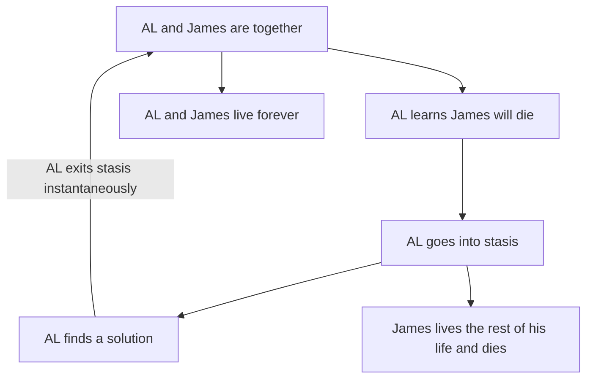
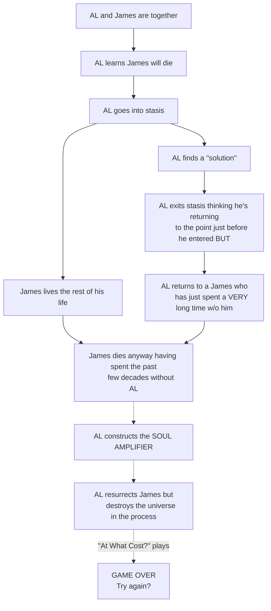

# The Cursed One
![[The Cursed One.mp3]]
%%
songTitle:: The Cursed One
songRemarks:: I uploaded this to Tumblr a long time ago.
trivial:: Added song metadata.
#trivialChange 
%%

# Al, THE SOUL TAKER
With enough [[SOUL|SOULS]], he will become godlike. His essence is eternal, but there has always been someone to banish him. SOULS taken by AL are gradually forgotten until they all but disappear from existence. #Cite/Game/Undertale  [gameRefType:: Undertale/Plot]

[question:: What draws people to AL? Not what makes someone willing to forfeit their SOUL, but what are the first steps? Does AL seek them out, or is he summoned?]

![[weird_bird.png]]
CURSED AL maybe?

Voice: he sounds like Michael McKean as Chuck McGill.
>I am not ~~crazy~~ cursed! I know he swapped those numbers. I knew it was 1216. One after Magna Carta. As if I could ever make such a mistake. Never. Never! I just - I just couldn't prove it. He covered his tracks, he got that idiot at the copy shop to lie for him. You think this is something? You think this is bad? This? This chicanery? He's done worse. That billboard! Are you telling me that a man just happens to fall like that? No! *He* orchestrated it! [[CURSED AL#^b26734|Jimmy]]! He *defecated* through a *sunroof*! And I saved him! And I shouldn't have. I took him into my own firm! What was I *thinking*? He'll never change. He'll *never* change! Ever since he was 9, *always* the same! Couldn't keep his hands out of the cash drawer! "But not our Jimmy! Couldn't be precious *Jimmy*!" Stealing them blind! And *HE* gets to be a ~~lawyer~~ wizard? What a sick joke! I should've stopped him when I had the chance!

#Cite/TV/Better-Call-Saul [tvRefType:: Better Call Saul/Character]

---
Lun
--
Going with my semi-convoluted [[Magic]] system, he might have become CURSED by the terrible after-effects of casting an incredibly powerful spell a very long time ago. Whatever could have prompted him to cast such a powerful spell knowing the dangers of free [[Mana]]? Perhaps it was for a greater good? After all, it was the last spell he cast before becoming CURSED...

---

## Other Notes
- Main Antagonist
- Unspeakably old (or maybe he's James's age?)
- Species: spoopy (a raven, maybe?)
- Has antlers though #Cite/TV/The-Owl-House [tvRefType:: The Owl House/Character]

%%
question:: CURSED AL age and species
%%

# Backstory with [[James Redawić|James]]?
#Cite/Unknown #Cite/TV/FMAB (?) #Cite/Game/Chrono-Trigger (?)
%%
uRefType:: Plot
tvRefType:: FMAB/Plot
gameRefType:: Chrono Trigger/Plot
%%
Going off the above and the ideas in [[Magic]], [[Legendary Artifacts]], and [[(6) June 2023 Chat Logs]], maybe AL knew James was fated to die. He devoted himself to preventing this. Keeping James alive became his singular obsession. Eventually, he realized he couldn't prevent James's death, but perhaps he could undo it? Such a powerful spell would require (and I do believe this is the technical term) an absolute shitload of mana, more than any one SOUL could possibly handle. But if he had [[SOUL AMPLIFIER|a way to use multiple SOULS simultaneously]]...

Oh, also, maybe he put himself into some sort of stasis dimension (possibly via [[Plane Shift]] or [[Astral Projection]]) while he was working this out. So he just kinda disappeared for who knows how long before suddenly reemerging shortly before James was fated to die. Maybe he thought it would work like this:
%%
sudoMinor:: Potentially explaining how AL went into stasis via spells.
#minorChange #unseenByLun 
%%

Except what actually happens is more like:

Also, he is the only one allowed to call James "Jimmy". ^b26734

---
Considering he's _preparing_ to cast a big fucko spell with this new addition (and has not yet cast it), [question:: what caused AL to become CURSED? His time in the stasis dimension thing? Or is he Just Like That.]

---
Maybe the real curse was all the friends we made along the way. Wait, no, that's not right. I'll come back to you on that.

Yeah, maybe his curse is "being ADHD-coded". And stasis is like hyperfixation.

Actually, his curse is that he's French. And that he's stuck in the Astral Plane for some reason. But mostly that's he French.

%%
sudoMinor:: Gave a brief response to your question, which is also in your DMs.
#minorChange #unseenByLun 
%%

#character #cursed-al #the-cursed-one #unanswered-questions #contains-music