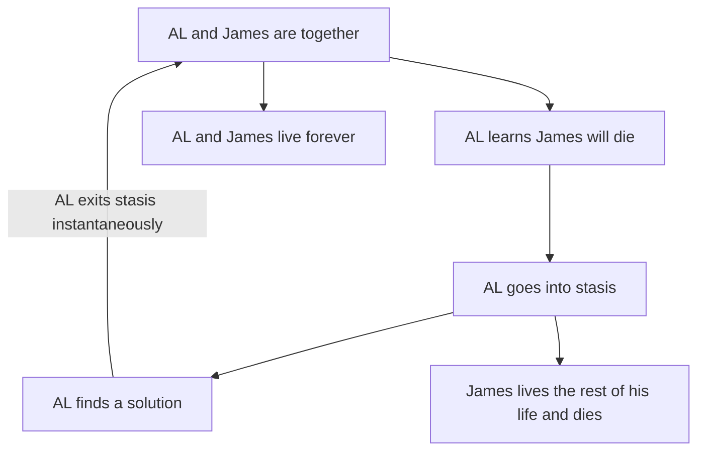
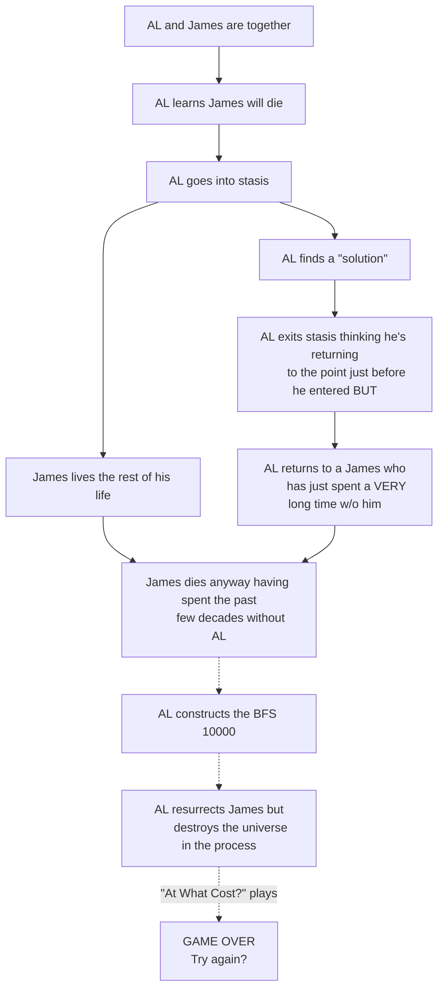

# The Cursed One
![[The Cursed One.mp3]]
%%
songTitle:: The Cursed One
songRemarks:: I uploaded this to Tumblr a long time ago.
%%

# Al, THE SOUL TAKER
With enough [[SOUL|SOULS]], he will become godlike. His essence is eternal, but there has always been someone to banish him. SOULS taken by AL are gradually forgotten until they all but disappear from existence. #Cite/Game/Undertale  [gameRefType:: Undertale/Plot]

[question:: What draws people to AL? Not what makes someone willing to forfeit their SOUL, but what are the first steps? Does AL seek them out, or is he summoned?]

![[weird_bird.png]]
CURSED AL maybe?

Voice: he sounds like Michael McKean as Chuck McGill.
>I am not ~~crazy~~ cursed! I know he swapped those numbers. I knew it was 1216. One after Magna Carta. As if I could ever make such a mistake. Never. Never! I just - I just couldn't prove it. He covered his tracks, he got that idiot at the copy shop to lie for him. You think this is something? You think this is bad? This? This chicanery? He's done worse. That billboard! Are you telling me that a man just happens to fall like that? No! *He* orchestrated it! [[CURSED AL#^b26734|Jimmy]]! He *defecated* through a *sunroof*! And I saved him! And I shouldn't have. I took him into my own firm! What was I *thinking*? He'll never change. He'll *never* change! Ever since he was 9, *always* the same! Couldn't keep his hands out of the cash drawer! "But not our Jimmy! Couldn't be precious *Jimmy*!" Stealing them blind! And *HE* gets to be a ~~lawyer~~ wizard? What a sick joke! I should've stopped him when I had the chance!

#Cite/TV/Better-Call-Saul [tvRefType:: Better Call Saul/Character]

---
Lun

Going with my semi-convoluted [[Magic]] system, he might have become CURSED by the terrible after-effects of casting an incredibly powerful spell a very long time ago. Whatever could have prompted him to cast such a powerful spell knowing the dangers of free [[Mana]]? Perhaps it was for a greater good? After all, it was the last spell he cast before becoming CURSED...

---

## Other Notes
- Main Antagonist
- Unspeakably old (or maybe he's James's age?)
- Species: spoopy (a raven, maybe?)
- Has antlers though #Cite/TV/The-Owl-House [tvRefType:: The Owl House/Character]

%%
aq:: CURSED AL age and species
%%

# Backstory with [[James Redawić|James]]?
#Cite/Unknown #Cite/TV/FMAB (?) #Cite/Game/Chrono-Trigger (?)
%%
uRefType:: Plot
tvRefType:: FMAB/Plot
gameRefType:: Chrono Trigger/Plot
%%
Going off the above and the ideas in [[Magic]], [[Legendary Artifacts]], and [[(6) June 2023 Chat Logs]], maybe AL knew James was fated to die. He devoted himself to preventing this. Keeping James alive became his singular obsession. Eventually, he realized he couldn't prevent James's death, but perhaps he could undo it? Such a powerful spell would require (and I do believe this is the technical term) an absolute shitload of mana, more than any one SOUL could possibly handle. But if he had [[BFS 10000|a way to use multiple SOULS simultaneously]]...

Oh, also, maybe he put himself into some sort of stasis dimension (possibly via [[Plane Shift]] or [[Astral Projection]]) while he was working this out. So he just kinda disappeared for who knows how long before suddenly reemerging shortly before James was fated to die. Maybe he thought it would work like this:

Except what actually happens is more like:

Also, he is the only one allowed to call James "Jimmy". ^b26734

---
Considering he's _preparing_ to cast a big fucko spell with this new addition (and has not yet cast it), [question:: what caused AL to become CURSED? His time in the stasis dimension thing? Or is he Just Like That.]

---
Maybe the real curse was all the friends we made along the way. Wait, no, that's not right. I'll come back to you on that.

Yeah, maybe his curse is "being ADHD-coded". And stasis is like hyperfixation.

Actually, his curse is that he's French. And that he's stuck in the Astral Plane for some reason. But mostly that's he French.

For real, though, maybe his curse wasn't caused by being in the stasis dimension. His curse **is** that he's in the stasis dimension. And [[Astral Projection]] doesn't work exactly the same way it does in D&D.

He can still influence people (hence the Radiance connection), but his physical body is just gathering dust in a corner somewhere. James does not know that he is stuck in the Astral Plane. In fact, James may not even know where AL's physical body is.

On the other hand, it'd be funny in a fucked up kind of way if he's just, like, sitting in a chair in James's living room or mounted on a pedestal like a taxidermy. And maybe he wasn't always gathering dust. James used to clean him up, but as the years went by, he lost hope and eventually AL's body was relegated to the attic or some sort of storage unit. (But that's not funny.)

---
Lun

Casting "fuck off into another plane of existence" seems like a pretty major spell, so the curse _could_ be caused by that. The problem is that with the current magic system, the backlash from casting overly powerful spells is very much localized to where you cast the spell as it's caused by the free [[Mana]] originating from the rift where you cast the spell. This means in this scenario that AL wouldn't have been hit by it, as the spell he cast zooped him away. James would have gotten hit instead. That could be pretty cool going with the "James hates AL" angle ([[James's Excuse]]) as it gives him another reason to be so pissed (and potentially _actually be crippled_, giving him another reason not to collect the artefacts himself), but doesn't explain why AL is cursed yet. ^fb3aaa

[Sudo]: Ooh, that's a good idea.

Some more thoughts in a list:
- AL's curse being that he's in the stasis dimension is a cool concept, but then how does that work when he gets free? I assume the story requires AL to get out so he can assemble the [[BFS 10000]] and eventually fight [[Luke Campbell|Luke]] and resurrect James. Does he become no-longer-CURSED AL?

[Sudo]: Maybe he has some sort of lieutenant on the Material Plane who will activate it for him. Or what if the [[BFS 10000]] is actually a portal? (Gravity Falls reference?!)

[Lun]: So he only comes back to the material plane after the [[BFS 10000]] is finished? But then he can't do anything in the story until the end (e.g. abduct Sam, fight Luke, look menacing). Well, his lieutenant can, but then what's the point of having AL if you only see his lieutenant anyway?

[Sudo]: In this scenario (which isn't yet canon), he's more like Bill Cipher or The Radiance. He can't physically do anything himself, but he still wields a great deal of influence. He controls other people and uses them to carry out tasks.

[Lun]: The moff 2.0...

- AL's body remaining in the physical realm slightly clashes with my thoughts in [[James's Excuse]]. Not inconsolably, but if James can find AL's body he can probably figure out what happened and get him back by using [[Dispel Magic]].

[Sudo]: Fuck, I forgot about Dispel Magic. Maybe that's another spell that just doesn't exist here. You don't dispel magic, you just seal the rift. That, or [[Astral Projection]] doesn't work the same way it does in D&D, which is already something I've been leaning towards.
[Sudo]: But if it does work similarly to how it does in D&D, then AL probably went to some fortified location prior to casting it to make sure nothing happens to his physical body. I believe I mentioned this in the article on [[Sam Ward|Sam]].

[Lun]: AL first teleporting to a fortified location before going into stasis seems to clash with the idea that he thought time would not advance on the material plane while he was in stasis. How would you make that work?

[Sudo]: Okay, maybe he wasn't going into stasis. Maybe there was something he could only obtain from a different plane of existence?

[Lun]: Mono: Into the multiverse?!

[Sudo]: I was thinking maybe the [[BEE]] comes from some Elemental Plane? And also the [[NEEDLE OF CALAGASH]] is on [[Campbell Farms]], but like, in the Upside Down. (Literally a needle in a haystack)

[Lun]: Consider that since the bee is contributing the poison it would be entirely reasonable for it to be from a Poison Swamp. Besides that, how did the needle get on the Campbell Farms?! Are his moms actually powerful mages as well? Actually, I have something to say about this on the [[Legendary Artifacts]]
^r5

sudo:: Sorry, was the Stranger Things reference lost on you? It's on Campbell Farms, but on a separate plane of existence. I'm not sure if this is how planes work in D&D, but I'm imagining them somewhat like layers in Photoshop. Mostly, I just wanted to make the "needle in a haystack" joke, and Campbell Farms seemed like a good location for a haystack. Good call with the BEE being in the poison swamp, though. (continues...) ([[CURSED AL#^r5|ref]])

>Actually, let me make sure we're on the same page wrt planes here. I'm thinking of it like a map. Latitude and longitude are the X and Y coordinates respectively. If we extend the map into 3 dimensions, the Z coordinate represents the plane of existence (I guess it technically already *is* in 3D, and the plane is more like the 4th dimension, but for the sake of simplicity, let's consider the planes as 2D for now). Let's also say the Material Plane extends from (-inf, -inf, 0) to (+inf, +inf, 0). So, if, for example, Campbell Farms is at (10.06475, -11.33150, 0), then the NEEDLE is at (10.06475, -11.33150, -3) or something. Does that track with your conception of planes?
>
>Two other notes:
>1. The X and Y axes are continuous, but the Z (planar) axis is discrete; you can't, e.g., go to (10.06475, -11.33150, 2.79625). That's just... not a thing.
>2. Because [[Teleport]] doesn't work the same way in MONO as it does in D&D, [[Plane Shift]] only permits travel along the Z axis. Your X and Y coordinates don't change. (Summoning [[Emperoress, The|The Emperoress]], as in [[2. Plot Overview (Again)]], is an exception.
#reply [R:: 5]

- Alternate idea: The stasis dimension isn't in the physical plane, or in the mana plane, but somewhere in between. This means that he could more freely experiment with mana, but was constantly exposed to a low dose of free mana effects, eventually changing him quite dramatically.

[Sudo]: Free Mana = Free Radicals?
[Sudo]: Oh, going off what I said about Dispel Magic, maybe Astral Projection requires a constant flow of free mana for as long as you're in the Astral Plane (whereas [[Plane Shift]] doesn't since it takes your physical body to the other plane; Astral Projection would likely be a forbidden spell, then). So, there's an active rift wherever AL's body is that's spilling a ton of free mana, and it has to be sealed. (Deltarune reference?!) Needless to say, this would be very not good if AL is in there a long time (for AL or the rest of the world).
[Sudo]: On the other hand, maybe this isn't a good idea. I would think a huge mana fountain would probably make AL pretty easy to find. (I was thinking maybe there are multiple rifts to throw you off, but I don't want to rip off Deltarune *that* much.)
[Sudo]: Maybe he just fell into the rift or something?

[Lun]: Maybe him plane shifting into a different plane would just be easier all around? Or do you want to make the astral projection thing work because that's AL's curse?

[Sudo]: From a Doylist perspective, his curse is that he's too single-minded/can't see the forest through the trees. (From a *very* Doylist perspective, his curse is being named CURSED AL.) He's too focused on saving James instead of cherishing the time they *do* have.
[Sudo]: (And maybe James being fated to die is, like, a metaphor for cancer or some shit? Idk. Not to get too off-topic, but I actually was thinking that living for a very long time would be likely to exponentially increase your risk of developing cancer, but I kinda just hand-waved that away by saying "It's *magic*".)
[Sudo]: Anyway, how his curse manifests in-universe should be symbolic of that somehow. Maybe he didn't literally think he was going into stasis. Maybe it just took him way longer than he expected/he lost track of time.

[Lun]: seems to fit with the idea that he's adhd coded lol

[Sudo]: That's what I was going for, yep!

---

#character #cursed-al #the-cursed-one #unanswered-questions #contains-music #answered-questions 
