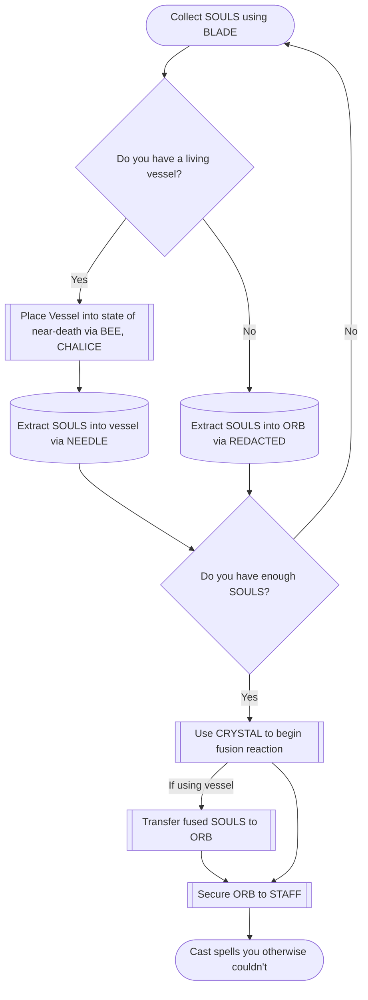

[[(Talk) BFS 10000|Talk]]

# Purpose/Function
Uses the [[Legendary Artifacts]] to allow the user to handle extreme amounts of [[Mana]] that would otherwise vaporize their [[SOUL]]. May also summon a large swarm of [[BEE|BEES]] from the [[BEE PLANE]]? (BEEBY DEEBY?)

## SOUL Extraction
When you kill someone with [[BLADE OF POWER|THE BLADE]], their [[SOUL]] goes *ZORP* and gets absorbed by THE BLADE.

THE BLADE can only contain one SOUL at a time, but you can draw on the power of any SOUL so contained as long as you wield THE BLADE.

## SOUL Transfer
How do you get a SOUL out of the BLADE OF POWER?

1. Kill someone else. The previous SOUL dissipates as it is replaced by the new one.
	1. SOULS really don't like not being contained by something.
2. Touch THE BLADE to a vessel, e.g. [[CURSED AL'S CURSED ORB|THE ORB]]. The SOUL is not guaranteed to remain stable when transferred this way.
	1. Maybe you have to use some sort of spell for this, or it has to be a specialized vessel. Otherwise, any inanimate object you touch with THE BLADE would just immediately become haunted.
3. Touch [[NEEDLE OF CALAGASH|THE NEEDLE]] to THE BLADE. The SOUL contained therein goes *SCHLOOP* as it travels up the needle via capillary action. Transferring SOULS this way keeps them more stable. You can even transfer them into a living vessel. See below.

### Transfer into Living Vessel
An extremely risky procedure. The vessel must be in a state of near-death, loosening the connection between the vessel's body and their own SOUL. If this is not done or if it is performed incorrectly, the vessel may reject the foreign SOUL(s), often violently.

Currently, the best method for this is as follows:
1. Extract raw venom from the [[BEE|CALAMITOUS BEE]] (Southern variety preferred[^bee], but other varieties will also work)
	1. How best to extract the venom is left as an exercise for the reader
2. Distill the venom. Certain compounds must be removed from the venom, or the final potion will be fatal instead of only nearly-fatal.
3. Pour the venom in the [[CHALICE OF SUDMORANTH]]. It is believed the lining of THE CHALICE acts as a catalyst to the reaction.
4. To the distilled venom, add silver nitrate, ash from Rolsenberry wood[^wood], and seer's sage[^sage]. Stir until completely dissolved.
5. On a night when the sky is clear and the wind is calm, when the moon hides her face behind the earth's shadow, hold the [[CRYSTAL OF GRELLNATH]] to your eye and gaze unblinking into the solution.
	1. If you don't want to wait for a lunar eclipse, you can just go directly to the [[Mana Plane]], but this is not advised for a number of reasons, chief among them is that it's just not as cool.
6. Speak aloud the unholy words: ![[Power Word Kill.png]]
	1. Written in an ancient tongue, we believe it is pronounced: \[ɪz θɪs lɔːs\]
7. Administer to the vessel promptly. The potion may also attract more BEES.

[^bee]: The southern variety has more potent venom, so you'll need fewer specimens.
[^wood]: I made this one up.
[^sage]: Scientific name *Salvia divinorum*. That's right, not only are they going to be near dead, they're also going to be tripping balls.

Once the vessel has been placed into this near-death state, you may add any number of SOULS to their body. It is recommended that you proceed to the next step quickly, as the presence of too many unfused SOULS in one body may have unpredictable results.

## SOUL Fusion
As stated above, the body tends to react violently to the presence of foreign SOULS unless placed in a state of near-death. However, even in such a state, multiple SOULS in close proximity are frequently unstable. They must be fused.

SOUL fusion essentially combines two or more SOULS into one unit. The mechanism behind it is unclear, but light focused through THE CRYSTAL seems to trigger the reaction. With inanimate objects, the resultant ÜBERSOUL begins to decay on exposure to [[Mana]] concentrations above 5 TEj, though casting spells that call for higher concentrations of Mana may still be possible. For ÜBERSOULS formed in living vessels, the bonds are predicted to remain stable at concentrations in excess of 1.21 PEj. Likewise, cumulative Mana exposure also induces decay, with limits varying on number of SOULS used and fusion method.

(For reference, even highly experienced mages may begin to experience mild symptoms of [[Mana#Mana Toxicity|Mana Toxicity]] at concentrations above 1 TEj; you're just not going to cast that many Level 8+ spells in your day-to-day life, so it's still going to be slightly above your tolerance.)

Even though ÜBERSOULS formed in living vessels are more stable, they aren't usable while still in the vessel's body. You will need to use [[NEEDLE OF CALAGASH|THE NEEDLE]] to transfer the ÜBERSOUL into a more appropriate container, such as [[CURSED AL'S CURSED ORB|THE ORB]].

For inanimate vessels:

| # of SOULS | Maximum Instantaneous Mana (Spell Level) | Maximum Cumulative Mana |
|------------|------------------------------------------|-------------------------|
| 2          | 313.64 GEj (7)                           |
| 3          | 50.91 TEj (8)
| 4          | 7.35 PEj
| 5          | 993.69 PEj
| 6          | 129.04 EEj
| 7          | 131.50 EEj
| 8          | 10.26 EEj
| 9          | 788.26 PEj
| 10         | 59.80 PEj

Formula for maximum instantaneous mana: $$m=1000*\frac{n e^n L_E}{E S^{|n-E|}}$$ where $m$ is the Mana cost, $n$ is the number of souls, $e$ is Euler's number, $L_E$ is Ejiofor's limit (1.21 PEj), $E$ is Ejiofor's constant (6.3459269958), and $S$ is the Stokoff constant (39.810686024)

Formula for maximum cumulative mana: $$m = \int_0^G 1000*\frac{ne^nL_E}{S^{|n-E|}} dn$$

## Using the SOULS
Once the ÜBERSOUL has been placed into [[CURSED AL'S CURSED ORB|THE ORB]], affix THE ORB to the top of [[STAFF OF RULKOHIM|THE STAFF]]. Grasp THE STAFF firmly and cast your spell(s). The Mana will flow through your body and concentrate in the ÜBERSOUL via THE STAFF. This reduces the amount of Mana required to remain in your own SOUL up to the maximum Mana tolerance of the ÜBERSOUL. (This depends on the manner in which the SOULS were fused, as well as the number of SOULS involved, up to a point.[^limit])

[^limit]: In 1968, Itzhak Stokoff theorized that an ÜBERSOUL could not consist of more than 13 SOULS, as it would immediately collapse in on itself, triggering a massive explosion.

# SOUL Beneficiary

![[Soul Beneficiary.mp3]]
%%
songTitle:: SOUL Beneficiary
songRemarks:: You've already heard this one. I uploaded it to Tumblr. But it was in October 2021, so maybe you forgot.

Lun: I remember hearing it, but I kinda forgot what it sounded like, so this is about 50% of a new song to me which I will take as a victory!

%%

 #items #soul #bfs10k #unanswered-questions  #contains-music #legendary-artifact 